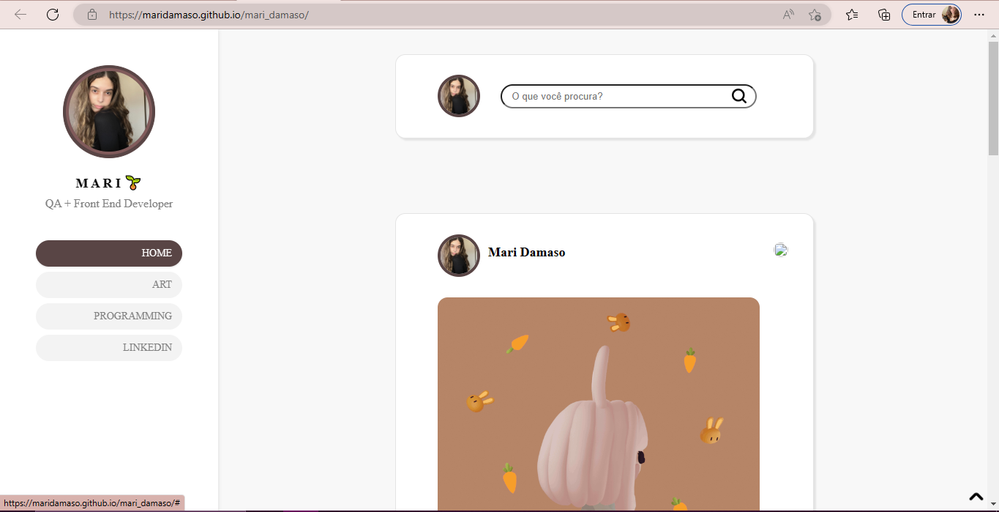
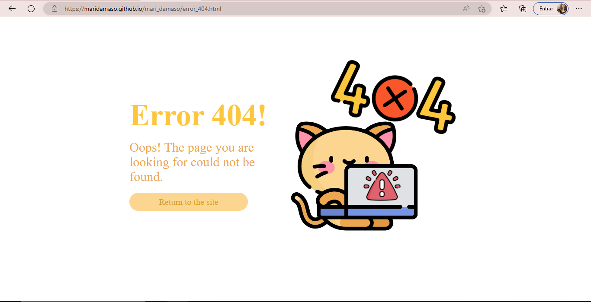

<h1 align="center"> ʕ •ᴥ• ʔ	Simple Blog Page </h1>

I made this simple project which is a web page for a personal blog based on tumblr pages. I'm learning more and more about responsiveness and trying to apply it to my projects.

🌱 With this project I intend to improve my skills in HTML and CSS languages.

<h2>/ᐠ - ˕ -マ How to access the project</h2>
<a href="https://maridamaso.github.io/mari_damaso/">Click here to access</a>
<h2>ฅ՞•ﻌ•՞ฅ Responsiveness</h2>

I used responsiveness for the web page to work on mobile devices and computers. I'm starting to use responsiveness now so it still doesn't work 100%.

<h2>(˵ •̀ ᴗ - ˵ ) ✧Project Images</h2>

For computers

For mobile devices

